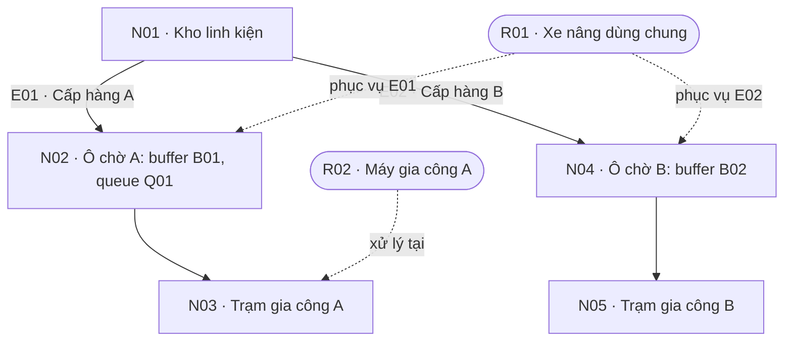
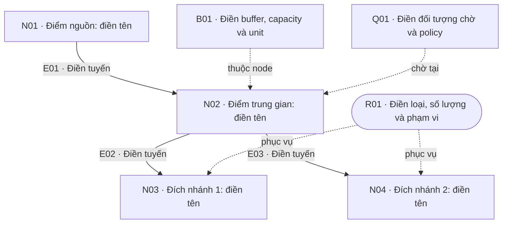

# Đào Văn Đức — giải thích và mẫu vẽ Factory Tour

**Mục đích:** nhìn một luồng logistics rồi ghi lại đủ thông tin để dựng mô phỏng.
**Trạng thái:** tài liệu chuẩn bị; mọi ví dụ và con số dưới đây đều giả lập,
không phải dữ kiện đã xác nhận tại DENSO.

Người ghi: … | Ngày/giờ/ca: … | Khu vực: … | Đơn vị vật tư đang theo dõi: …

## 1. Sáu khái niệm cần phân biệt

| Khái niệm | Câu hỏi nó trả lời | Định nghĩa | Ví dụ nhà máy |
|---|---|---|---|
| **Node — điểm/công đoạn** | Vật tư đang ở đâu, đi qua đâu? | Một vị trí hoặc công đoạn được biểu diễn trong mô hình luồng | Kho linh kiện, điểm nhận hàng, trạm gia công, trạm kiểm tra |
| **Route — tuyến/đường đi** | Vật tư đi từ đâu đến đâu, qua đường nào? | Một đường đi nối các node; có thể gồm nhiều đoạn và điểm trung gian | Tuyến xe nâng từ kho qua hành lang đến ô chờ của trạm A |
| **Resource — nguồn lực phục vụ** | Ai/cái gì làm việc, làm đồng thời được bao nhiêu? | Xe, người, máy hoặc nhóm nguồn lực có năng lực phục vụ hữu hạn | Một xe nâng dùng chung cho hai trạm; hai công nhân đóng gói |
| **Buffer — vùng chứa đệm** | Có thể giữ vật tư ở đâu và tối đa bao nhiêu? | Vị trí chứa vật tư tạm thời giữa các hoạt động; thường có giới hạn sức chứa | Ô chờ trước trạm A chứa tối đa 4 pallet |
| **Event — sự kiện** | Điều gì thay đổi trạng thái, tại thời điểm nào? | Một mốc tức thời trong mô hình làm thay đổi trạng thái hệ thống | Xe bắt đầu đi; dỡ hàng xong; máy bắt đầu hoặc kết thúc xử lý |
| **Queue — hàng đợi** | Những vật tư/yêu cầu nào đang chờ, chờ gì, ai đến lượt? | Tập vật tư hoặc yêu cầu chưa được phục vụ, kèm quy tắc chọn phần tử tiếp theo | Ba pallet chờ máy A; hai yêu cầu cấp hàng đang chờ xe nâng |

**Entity/job** là thứ được theo dõi qua luồng, ví dụ một pallet hoặc một yêu
cầu cấp vật tư. Đây là khái niệm nền: trước khi đếm queue hay buffer, phải
biết đang đếm pallet, box, sản phẩm hay yêu cầu.

### Những chỗ dễ nhầm

- **Node và resource:** trạm A là node trong sơ đồ; máy đặt tại trạm A là
  resource xử lý job. Cùng một đối tượng thực tế có thể được mô tả theo hai
  vai trò, nhưng không tạo hai máy trong mô hình vì có hai nhãn.
- **Buffer và queue:** buffer là chỗ chứa; queue là các đối tượng đang chờ.
  B01 có sức chứa 4 pallet, hiện chứa 3 pallet đều sẵn sàng chờ máy A: mức
  buffer là 3, độ dài Q01 cũng là 3. Đó vẫn là cùng 3 pallet, không phải 6.
  Hai yêu cầu chờ xe có thể tạo một queue trên bảng điều phối mà không cần
  một ô chứa vật lý riêng. Không phải mọi vật tư được lưu trong buffer đều
  đang chờ cùng một dịch vụ.
- **Buffer và node:** một ô đệm có thể được vẽ thành node riêng, hoặc gắn với
  node trạm. Chọn cách biểu diễn nhất quán và ghi quan hệ ID.
- **Event và hoạt động:** “bắt đầu gia công lúc 08:06” là event; “gia công từ
  08:06 đến 08:09” là hoạt động có thời lượng. “Gia công kết thúc” là event khác.
- **Số resource và sức chở:** 2 xe là số resource; 3 pallet/chuyến là sức chở
  của một xe. Hai đại lượng này cần hai trường khác nhau.

## 2. Ví dụ tổng thể: một xe nâng cấp hàng cho hai trạm

Ví dụ giả lập có kho N01, hai ô chờ N02/N04, hai trạm N03/N05. R01 là xe nâng
dùng chung cho tuyến E01 và E02. B01 là buffer tại N02; Q01 là các pallet trong
B01 đang chờ máy R02 của trạm A. Giả sử B01 chứa tối đa 4 pallet.

Mũi tên liền chỉ chiều vật tư; nét đứt chỉ quan hệ resource phục vụ tuyến/trạm,
không phải một đường vận chuyển khác. Đây là sơ đồ logic, không thể suy ra
khoảng cách vật lý từ vị trí các hình trên trang.

Một pallet J01 có thể trải qua các mốc minh họa sau:

| Giờ giả lập | Event | Trạng thái thay đổi |
|---|---|---|
| 08:00 | EV01 — tạo yêu cầu cấp J01 | Yêu cầu vào Q02, hàng đợi chờ xe tại kho |
| 08:01 | EV02 — bắt đầu vận chuyển J01 | Yêu cầu ra Q02; R01 bị chiếm dụng; J01 ở trên xe |
| 08:04 | EV03 — xe đến N02 | J01 đã đến điểm giao nhưng chưa được tính là đã dỡ vào B01 |
| 08:05 | EV04 — dỡ J01 xong | J01 vào B01 và Q01; xe tiếp tục theo quy trình giải phóng/quay về đã ghi nhận |
| 08:06 | EV05 — máy A bắt đầu xử lý J01 | J01 ra Q01/B01; R02 bắt đầu bận |
| 08:09 | EV06 — máy A xử lý xong J01 | R02 được giải phóng; J01 đi tiếp theo luồng |

Trong ví dụ này, J01 chờ máy 1 phút và được gia công 3 phút. Thời điểm xe được
sẵn sàng nhận việc mới phải hỏi riêng: ngay sau dỡ, sau quay về kho, hay sau
một thao tác khác? Không suy ra điều đó chỉ từ event xe đến nơi.

Nếu B01 đã đầy khi xe đến, cần hỏi vật tư chờ ở đâu và xe có bị giữ lại không.
Nếu R01 đang phục vụ A, yêu cầu của B có thể phải chờ. Đây là những tương tác
cần ghi lại để mô phỏng được resource dùng chung và tình trạng tắc.

## 3. Quy ước ID và ký hiệu để vẽ

| Loại | ID gợi ý | Cách thể hiện trên giấy | Thông tin ngắn ghi cạnh hình |
|---|---|---|---|
| Node | N01, N02… | Hình chữ nhật | Tên điểm/công đoạn |
| Route | E01, E02… | Mũi tên có hướng giữa các node | Resource, khoảng thời gian, chiều về |
| Resource | R01, R02… | Hình oval, nối nét đứt đến nơi phục vụ | Loại, số lượng, các tuyến/trạm dùng chung |
| Buffer | B01, B02… | Khung nhỏ tại node hoặc node riêng | Sức chứa và mức hiện tại, cùng đơn vị |
| Event | EV01, EV02… | Ghi trên bảng thời gian ở cạnh sơ đồ | Tên event, timestamp, trạng thái đổi |
| Queue | Q01, Q02… | Nhãn hàng đợi gắn với node/buffer/resource | Chờ gì, độ dài, FIFO/priority/UNKNOWN |

Đây là quy ước ghi chép đề xuất, không phải yêu cầu phải dùng một chuẩn sơ đồ
cụ thể. Nét đứt không được lẫn với route vật tư. Dùng EV cho event để tránh
nhầm E của route.

## 4. Mẫu trống cho từng khái niệm

### A. Node — vẽ các điểm trước

**Cần quan sát:** điểm vào/ra, thứ được xử lý, công đoạn trước/sau; có nhánh,
vòng lặp, hàng lỗi hoặc rework không?

| Node ID | Tên và vai trò | Vật tư vào → ra | Node trước / sau | Buffer/resource gắn với node | Nguồn / unknown |
|---|---|---|---|---|---|
| N01 | … | … | … | … | … |
| N02 | … | … | … | … | … |
| N03 | … | … | … | … | … |
| N04 | … | … | … | … | … |
| N05 | … | … | … | … | … |

### B. Route — nối đường đi thật giữa các điểm

**Cần quan sát:** đi qua đâu, một chiều/hai chiều, có đường thay thế không,
điểm giao cắt có phải chờ không; thời gian đang ghi đã gồm những phần nào?

| Route ID | Từ → qua → đến | Resource được dùng | Đơn vị vận chuyển / batch | Thời gian đi và đơn vị | Chiều về / giới hạn / nguồn |
|---|---|---|---|---|---|
| E01 | … | … | … | … | … |
| E02 | … | … | … | … | … |

Tách travel time, loading, unloading, waiting và return time nếu quan sát
được; tránh cộng hai lần phần thời gian đã nằm trong một phép đo tổng.

### C. Resource — xác định ai/cái gì bị chiếm dụng

**Cần quan sát:** số lượng thực sự hoạt động, khả năng phục vụ đồng thời, phạm
vi dùng chung, lịch ca/nghỉ; thời điểm nhận việc và sẵn sàng nhận việc tiếp.

| Resource ID | Loại / số lượng | Sức chở hoặc khả năng xử lý | Phục vụ node/route nào? | Bắt đầu chiếm → giải phóng | Lịch / hạn chế / nguồn |
|---|---|---|---|---|---|
| R01 | … | … | … | … | … |
| R02 | … | … | … | … | … |

Hai xe cùng loại chưa chắc thuộc cùng một pool nếu không được đổi tuyến hoặc
đổi khu vực. Một resource dùng chung phải giữ cùng ID ở các nơi liên quan.

### D. Buffer — ghi cả sức chứa và hành vi khi đầy/rỗng

**Cần quan sát:** vị trí vật lý, đơn vị sức chứa, số vật tư hiện thấy; sức chứa
có tính cả vật tư đang được máy xử lý không; ai bị ảnh hưởng khi đầy/rỗng?

| Buffer ID / node | Capacity + đơn vị | Mức hiện tại + thời điểm | Đầy thì chuyện gì xảy ra? | Rỗng ảnh hưởng ai? | Queue liên quan / nguồn |
|---|---|---|---|---|---|
| B01 / … | … | … | … | … | … |
| B02 / … | … | … | … | … | … |

Không ghi capacity = 4 chỉ vì đang thấy 4 pallet. Đó có thể chỉ là mức hiện
tại; capacity cần quan sát giới hạn vị trí hoặc được người vận hành xác nhận.

### E. Event — ghi các mốc làm trạng thái thay đổi

**Cần quan sát:** tên sự kiện, cái gì kích hoạt, job nào, timestamp, resource
chiếm/nhả, hàng đợi hoặc buffer tăng/giảm. Ghi event đến nơi và dỡ xong riêng
nếu thời gian dỡ là một phần quan trọng của luồng.

| Event ID / tên | Timestamp + đơn vị | Điều kiện kích hoạt | Job / node | Trạng thái trước → sau | Resource / queue / buffer bị tác động |
|---|---|---|---|---|---|
| EV01 / … | … | … | … | … | … |
| EV02 / … | … | … | … | … | … |
| EV03 / … | … | … | … | … | … |

Thời gian xử lý được suy ra từ hai mốc bắt đầu/kết thúc của cùng job, cùng
công đoạn. Ghi được thêm nguồn clock/log và độ chính xác timestamp thì tốt.

### F. Queue — ghi rõ đang chờ gì và thứ tự phục vụ

**Cần quan sát:** chờ máy, xe, người hay chỗ trống; đối tượng chờ là vật tư hay
yêu cầu; queue vật lý hay trên hệ thống; chọn việc tiếp theo theo quy tắc nào?

| Queue ID / vị trí | Đối tượng chờ | Chờ resource/điều kiện gì? | Số đang chờ + thời điểm | FIFO / priority / UNKNOWN | Giới hạn / buffer liên quan |
|---|---|---|---|---|---|
| Q01 / … | … | … | … | … | … |
| Q02 / … | … | … | … | … | … |

**Mẫu để ghi thứ tự và thời gian chờ:**

| Queue ID | Job/request ID | Vào hàng đợi lúc | Bắt đầu được phục vụ lúc | Mức ưu tiên | Lý do được chọn / nguồn |
|---|---|---|---|---|---|
| … | … | … | … | … | … |
| … | … | … | … | … | … |

FIFO là phục vụ theo thứ tự vào hàng đợi. Có priority thì một yêu cầu đến sau
có thể được phục vụ trước. Không mặc định nhà máy dùng FIFO khi chưa hỏi.
Queue đang dài không tự chứng minh đó là bottleneck; cần xem tải, thời gian
chờ, resource bận và tình trạng bị chặn ở phía sau.

## 5. Mẫu sơ đồ để copy và điền

Đây là **khung vẽ có hai nhánh minh họa**, chưa phải flow đã quan sát. Thay
nhãn, thêm/bớt node và sửa các cạnh theo thực tế; chỗ chưa rõ ghi UNKNOWN.

Nếu buffer được vẽ thành một node vật lý trong đường đi, hãy đưa nó vào luồng
mũi tên liền. Khung trên dùng cách gắn buffer với node bằng quan hệ nét đứt.
Chỉ giữ hai liên kết resource nếu thực tế xác nhận dùng chung. Event ghi bằng
bảng thời gian ở mục 4E; không biến mỗi event thành một địa điểm trên sơ đồ.

## 6. Cách ghi tại nhà máy, theo thứ tự

1. Chọn một đơn vị vật tư/yêu cầu để theo dõi và xác định phạm vi đầu–cuối.
2. Vẽ node và route trước; đánh số và chỉ chiều vật tư.
3. Gắn resource vào đúng tuyến/trạm; nối các nơi dùng chung cùng một resource.
4. Đánh dấu buffer và queue; ghi capacity, mức hiện tại và quy tắc chờ.
5. Theo dõi một vài job, ghi event và thời gian; tách đi, dỡ, chờ, xử lý.
6. Hỏi tình huống buffer đầy/rỗng, xe bận và job ưu tiên; ghi phần chưa rõ.
7. Vẽ lại ngay sau khu vực nếu không được chụp ảnh; giữ nguồn cho từng ghi nhận.

**Phiếu nguồn dùng kèm các bảng:**

| ID tham số/ghi nhận | Giá trị hoặc mẫu thô | Đơn vị | Nguồn, n, ngày/giờ/ca | observed / estimated / assumed | Confidence + lý do | Cần mentor? |
|---|---|---|---|---|---|---|
| … | … | … | … | … | … | … |

Observed = nhìn/đo/được cung cấp rõ; estimated = ước lượng có cơ sở; assumed =
giả định để thử. Chưa biết thì để UNKNOWN, không điền một số giả định thành
observed. Giữ đơn vị gốc; ghi min–max mẫu hay khoảng ước lượng, không tự gọi
đó là khoảng tin cậy thống kê. Đây là phiếu ghi chép, chưa đổi schema chung.

## 7. Checklist mang về và debrief

- [ ] Một process map có đầu/cuối rõ; mục tiêu ≥5 node nếu lát cắt phù hợp.
- [ ] Route có hướng và resource phục vụ được ghi rõ.
- [ ] Ít nhất một shared resource được xác nhận, hoặc ghi rõ chưa tìm thấy.
- [ ] Ít nhất một buffer/queue, có đơn vị và hành vi khi đầy/rỗng.
- [ ] Có bảng event của ít nhất một job nếu điều kiện quan sát cho phép.
- [ ] Ít nhất 5 parameter range có nguồn, đơn vị và confidence.
- [ ] Một bottleneck hypothesis kèm dấu hiệu và giải thích thay thế.
- [ ] Hai what-if thực tế để trao đổi với Minh về tính khả thi.
- [ ] Liệt kê các unknown quan trọng nhất cần hỏi mentor.

Mục tiêu số lượng là để hướng việc khảo sát; không thêm node/resource giả để
đủ checklist. Chọn một lát cắt đủ hiểu được thay vì cố vẽ cả nhà máy.

**Phiếu giả thuyết và what-if:**

| Chỗ nghi tắc | Dấu hiệu đã thấy | Giải thích khác | Thay đổi muốn thử | Giới hạn/cần ai xác nhận? | KPI cần so |
|---|---|---|---|---|---|
| … | … | … | … | … | … |

Tối 11/09: điền [process map v0.1](../domain/denso_process_map_v0.1.md);
nhờ Khánh nối ID/units/provenance, Minh nối action/constraint/KPI và Hưng đọc
lại flow. Phối hợp với [checklist của Minh](../factory_tour/minh_optimization_questions.md).
Các quyết định mô hình còn cần chốt ở [bản thiết kế DES](../simulation/des_mvp_decisions.md).
Ghi chú thô và dữ liệu chưa được phép chia sẻ giữ ngoài Git, theo quy tắc repo.
